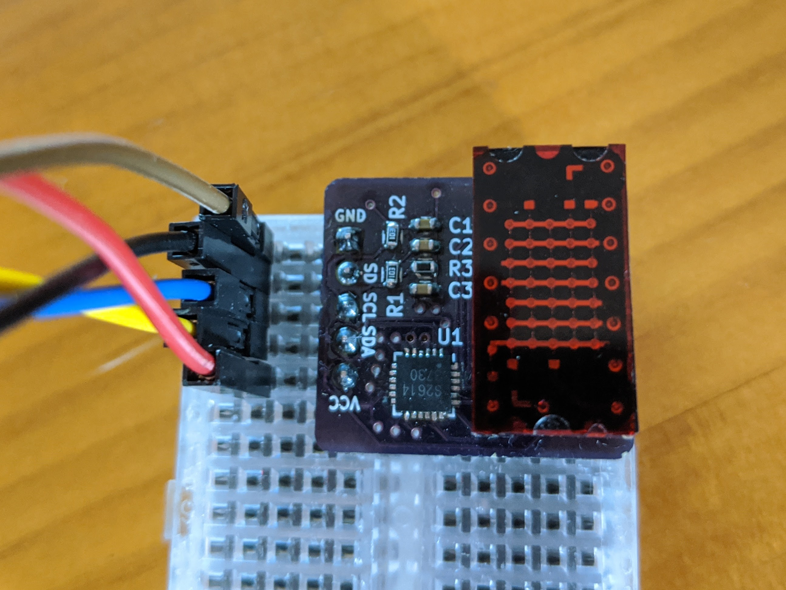
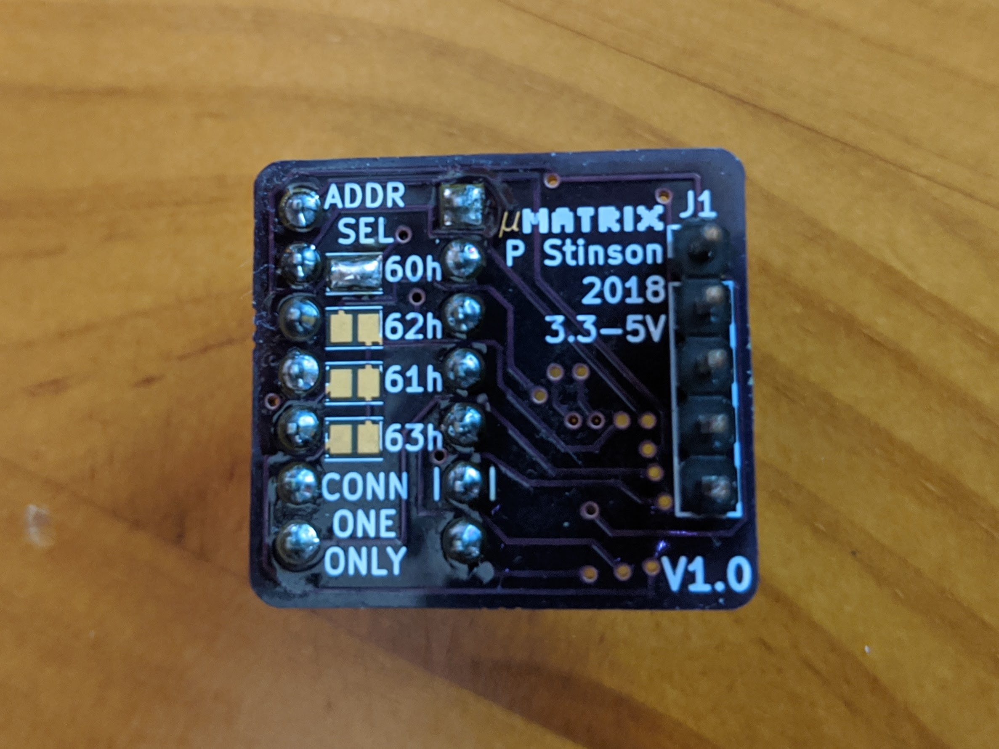

# µMatrix PCB
Small pcb design (< 1 inch square) with an onboard 5x7 LED matrix, controllable over I2C.

The LED matrix display used is the LTP-305/G from Lite-On Inc. The IS31FL3730 LED matrix driver IC, from ISSI Inc., is used to drive the matrix and provide control over I2C. The I2C address can be selected with solder jumpers on the back of the board from four possible options. It is compatible with power and logic at both 3.3 and 5V.

Also included in this repository is a simple software example for driving the display with an Arduino Uno or similar microcontroller development board. The basic implementation allows for displaying of text on the matrix, either flashed one character at a time or scrolled continuously across the display. Currently the font only supports the capital letters from A-Z and spaces.

